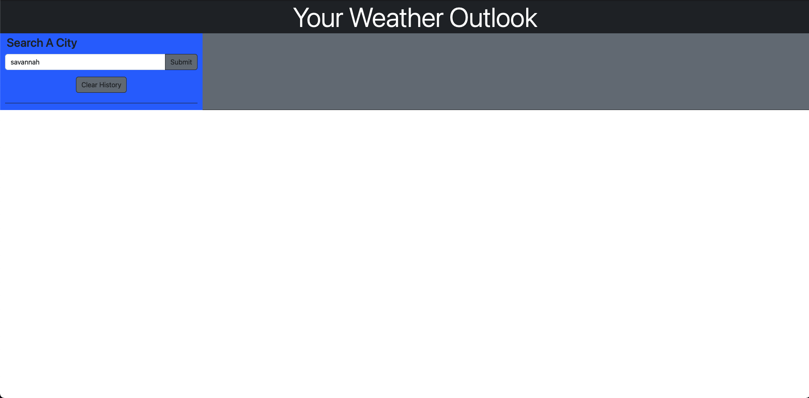

# Challenege-6-Weather-Dashboard

  ## Table-of-Contents
  - [Description](#description)
  - [Installation](#installation)
  - [License](#license)
  - [Usage](#usage)
  - [Contribution](#contributing)
  - [Questions](#questions)
  
  ## Description 
  Want a quick and easy way to check the weather? Then check out this lovely weather dashboard for your current weather and a five day forecast.  
  
  ## Installation 
  No installation needed just click the deployed link and dress acordingly!
  
  ## License 
  [For more information about the license click here](https://choosealicense.com/licenses/mit/)
  
  ## Usage 
  An app for finding out the weather in any city for today or the next five!
  
  ## Contribution 
  The repo is public so all are welcome to contribute if you’d like. Let me know if you’d like to help!
  
  ## Questions 
  If you have any questions at all feel free to contact me here or by email:
  
  [GitHub](https://github.com/jonrushing)

  [Email: jonrushingstuff@gmail.com](mailto:jonrushingstuff@gmail.com)

 Deployment Link:

 
 
 
 
